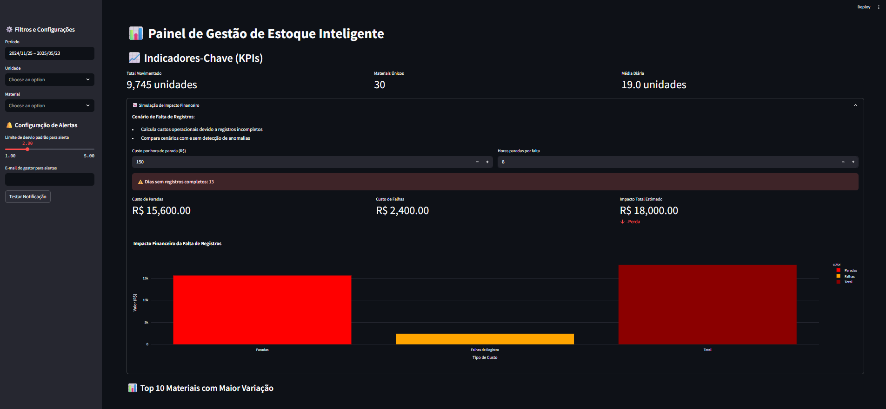

<h1 align="center">📊 Challenge de Data Science - Dasa & FIAP</h1>

  <strong>Dashboard Streamlit para análise preditiva e detecção de anomalias em fluxo de materiais</strong>

  
  
  

  

<h2>📖 Introdução</h2>

  Este repositório contém o projeto desenvolvido em parceria entre a empresa <strong>Dasa</strong> e a <strong>FIAP - Faculdade de Informática e Administração Paulista</strong>, no contexto da disciplina de Ciência de Dados.

  O desafio proposto tem como foco a <strong>identificação de anomalias nos registros de consumo de materiais em unidades operacionais</strong>, visando melhorar a acurácia dos dados e a eficiência no controle de estoque.

  A proposta envolveu diversas etapas práticas de análise de dados, partindo da <strong>simulação de um conjunto de dados</strong> que representa registros manuais de entrada e saída de materiais, frequentemente suscetíveis a erros e inconsistências. 
  A partir desses dados, aplicamos <strong>técnicas estatísticas e de detecção de outliers</strong>, como o <em>Z-score</em> e o <em>Intervalo Interquartil (IQR)</em>, para identificar padrões de consumo fora do comportamento esperado.

  Com os resultados, desenvolvemos um <strong>painel de alertas</strong> interativo que destaca os casos mais críticos de desvios e possíveis erros de registro. 
  Além disso, realizamos uma <strong>simulação do impacto financeiro</strong> causado por essas inconsistências, demonstrando como a falta de visibilidade pode afetar significativamente os custos da operação.

  Este projeto foi realizado por um grupo de cinco integrantes e reflete a aplicação prática de conceitos de estatística, programação e visualização de dados para a resolução de problemas reais no setor de saúde.

<h2>👥 Integrantes</h2>

<ul>
  <li>Rafael Menezes Viana — RM: 558287</li>
  <li>Guilherme Santos Nunes — RM: 558989</li>
  <li>Kaique Rodrigues Zaffarani — RM: 556677</li>
  <li>Kairo da Silva Silvestre de Carvalho — RM: 558288</li>
  <li>Pedro Josué Pereira Almeida — RM: 554913</li>
</ul>

<h2>📋 Tabela de Conteúdos</h2>

<ul>
  <li><a href="#-visão-geral">Visão Geral</a></li>
  <li><a href="#-requisitos">Requisitos</a></li>
  <li><a href="#-instalação">Instalação</a></li>
  <li><a href="#-execução">Execução</a></li>
  <li><a href="#-estrutura-do-projeto">Estrutura do Projeto</a></li>
  <li><a href="#-funcionalidades">Funcionalidades</a></li>
  <li><a href="#-configuração">Configuração</a></li>
  <li><a href="#-licença">Licença</a></li>
</ul>

<h2>🔍 Visão Geral</h2>

Solução completa para gestão de estoque com:

<ul>
  <li>✅ Detecção automática de anomalias (Z-score e IQR)</li>
  <li>📈 Simulação de impacto financeiro</li>
  <li>📧 Alertas por e-mail em tempo real</li>
  <li>📊 Visualizações interativas com Plotly</li>
</ul>

<h2>📦 Requisitos</h2>

<ul>
  <li>Python <strong>3.8+</strong></li>
  <li>Pip (gerenciador de pacotes)</li>
  <li>Git (opcional, para clonar o repositório)</li>
</ul>

<h2>⚙️ Instalação</h2>

<h3>1. Clone o repositório</h3>

<pre>
git clone https://github.com/vianafs/Challenge-DataScience.git
cd Challenge-DataScience
</pre>

<h3>2. (Opcional) Crie e ative um ambiente virtual</h3>

<pre>
python -m venv venv
# Linux/MacOS
source venv/bin/activate
# Windows
.\venv\Scripts\activate
</pre>

<h3>3. Instale as dependências</h3>

<strong>Instalação Básica:</strong>

<pre>
pip install streamlit pandas plotly numpy scipy
</pre>

<h3>4. Para desenvolvedores (opcional)</h3>

Instale também ferramentas de desenvolvimento:

<pre>
pip install pytest pre-commit python-dotenv
</pre>

<h2>🚀 Execução</h2>

Para iniciar o dashboard, execute o comando abaixo:

<pre>
streamlit run app.py
</pre>

O aplicativo estará disponível em: <a href="http://localhost:8501" target="_blank">http://localhost:8501</a>

<h2>📂 Estrutura do Projeto</h2>

<ul>
  <li><code>app.py</code>: Arquivo principal para execução do Streamlit e Análises exploratórias e modelagem estatística</li>
  <li><code>controle_estoque.csv/</code>: Conjunto de dados simulados</li>
</ul>

<h2>✨ Funcionalidades</h2>

<ul>
  <li>Detecção de outliers via Z-score e IQR</li>
  <li>Painel interativo com gráficos dinâmicos</li>
  <li>Simulação de impacto financeiro</li>
  <li>Envio de alertas por e-mail (em desenvolvimento)</li>
</ul>

<h2>⚙️ Configuração</h2>

Configure variáveis de ambiente no arquivo <code>.env</code> conforme necessário, por exemplo, para credenciais de envio de e-mails ou configurações do painel.

